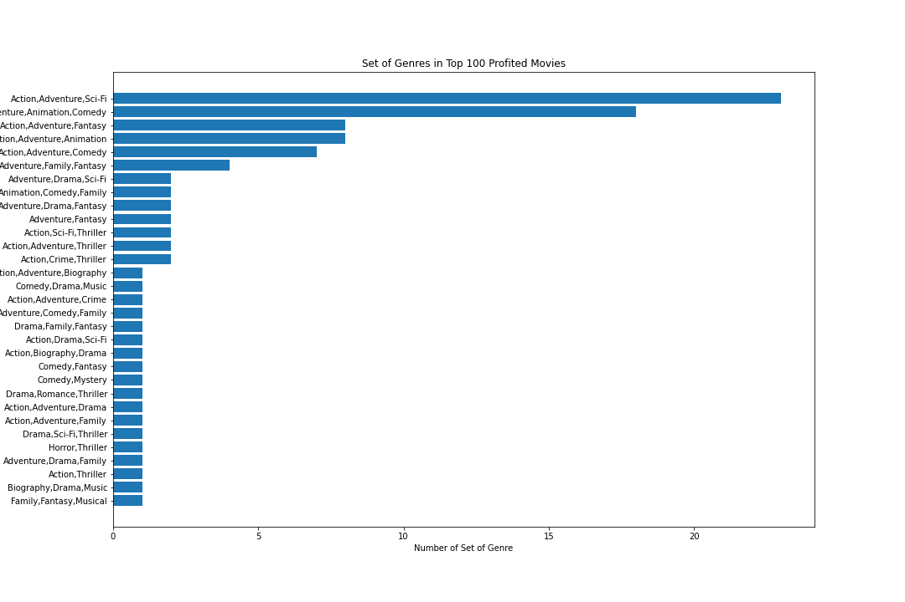
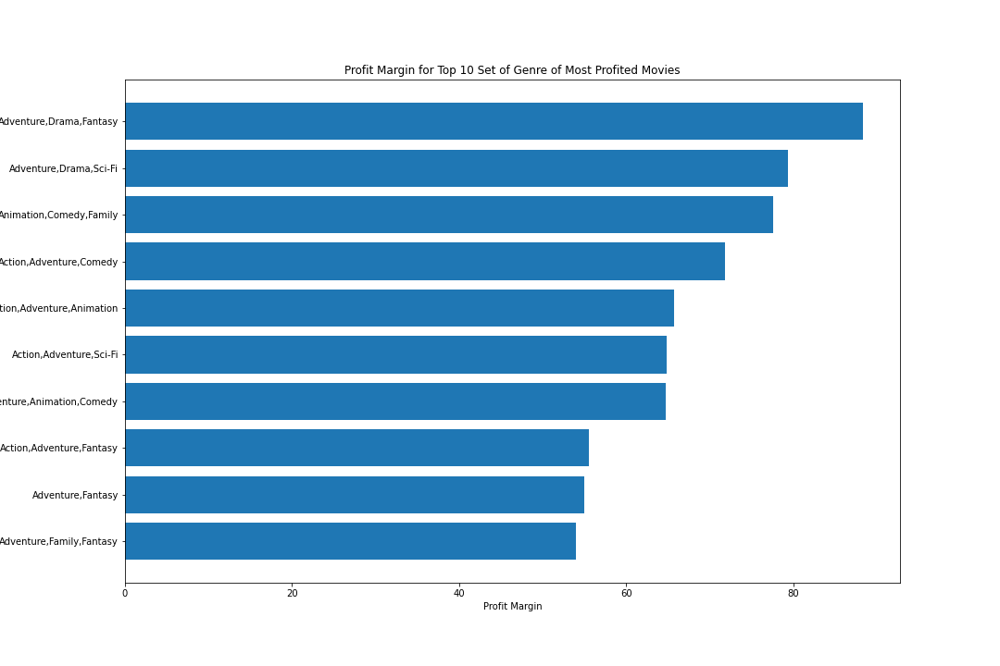
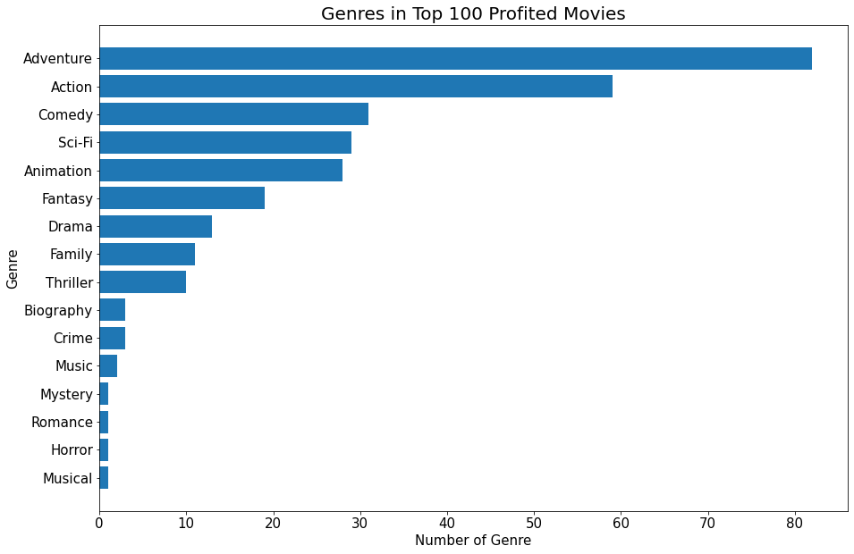
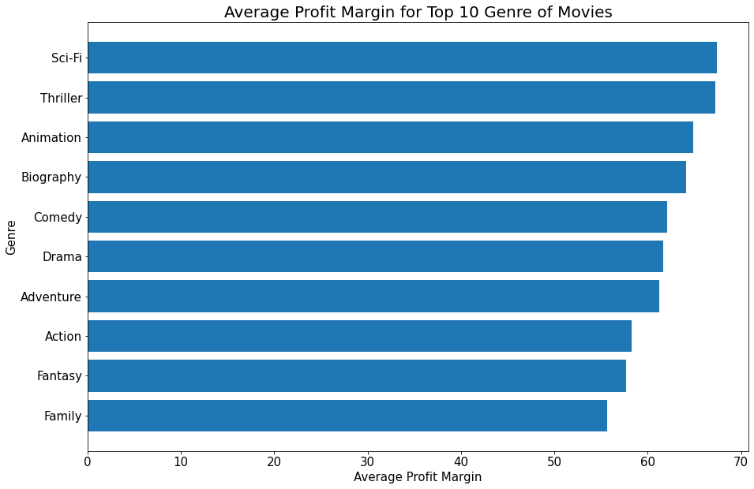

# Movie Analysis
 

## Overview
This project will analyze what types of films are currently doing the best at the box office to help Microsoft decide what type of films to create.  

## Business Problem
### What is the best type of movie to make for maximum profit?
We each looked at what aspects of a movie will make maximum profit.
* Correlation of budget and profit margin
* Popular Genres
* Parental Ratings that give best return 

## How to choose which movie to create
### Budget vs. Profit Margin
#### If Microsoft spends x amount more, will profits increase by y?
First, we filtered out movies that was release before 2005 to get approximately 10 years worth of data. 
Since the range of the production budget was big, we created a box plot to see which range of budget we should use to analyze. 
(box plot) 
After looking at the box plot above, we decided to separate movies in 3 different ranges: below the 25th percentile, between the 25th and the 75th percentile, and above the 75th percentile to see correlation of budget and profit margin.
With our filtered data, now we asked ourselves: for Microsoft to enter the film industry, what's a good production budget? 
(low corr data table) 
(mid corr data table) 
(high corr data table) 
You can see that there is positive correlation between profit margin and production budget and the highest correlation between production budget and profit in the above the 75th percentile data. So, we will be focusing on the data that is above the 75th percentile data.
(scatter plot) 
(75th percentile data describe table)  
Although we can see from the above data that the correlation between Budget and Profit Margin is not very strong, it does still exist.
As part of our recommendations, a budget of $115,000,000 is ideal for maximizing Profit Margin, though there is much more that goes into creating a high-profit movie.

### Genre
After sorting the movies using profit, we took the sets of genres from each movie and created bar graph to show popular sets of genres in a movie that profited the most. 
Using the data, we created bar graph to show the sets of genres that are popular for each movie that profited the most. With that data, we took the top 10 sets of genres and found the average profit margins for each of them. 
 
 
You can see that "Action, Adventure, Comedy" and "Action, Adventure, Animation" are in the top 5 in both graphs are the in the top 5 for both graphs. However, using sets of genres limits our choices in choosing each genre for a movie that will profit the most.  
Now, let's get individual genre and see what genres are popular in the top 100 most profited movies. 
Using the data, we created bar graph to show individual genres that are popular for each movie that profited the most. With that data, we took the top 10 of genres and found the average profit margins for each of them. 
 
 
You can see that Sci-Fi, Animation, and Comedy are in the top 5 in both graphs. This means that these genres make high profit movie with good profit margins.  
From the analyzed data, our genre recommendations are Sci-Fi, Animation, and Comedy.

### Rating
We selected all the movie ratings from the data table and counted each ratings. We, then, dropped all the null data and sorted the movies by box office. 
 
Let's see how the districution of box office earnings are for each rating.
 
Even though the R rating is more popular in our data set, PG-13 dominates in overall earnings.  
To see the distribution of earnings, we are going to see separate our data into box office earning of below $15M, box office earning of $15M to $40M, and box office earning of above $40M. 
 
You can see that the R rating dominates this category at almost 60%. 
 
You can see that the R rating takes comes in first at almost 50%. 
 
As you can see, the PG-13 category performs the best on above average earnings in the box office.  
From the graphs above, lower the earnings are, the most rating of the movie was R-rated. Higher earning movies was PG-13. This shows why our first bar graph showed more R-rated movies but our second stacked-bar graph showed more earnings for PG-13.  
From the data we were given, our recommendation is to make a movie with the PG-13 rating

## Conclusion
After analyzing our data, to make maximum profit movie, we recommend:
* Budget: $115,000,000
* Genre: Scie-Fi, Animation, Comedy
* Rating: PG-13