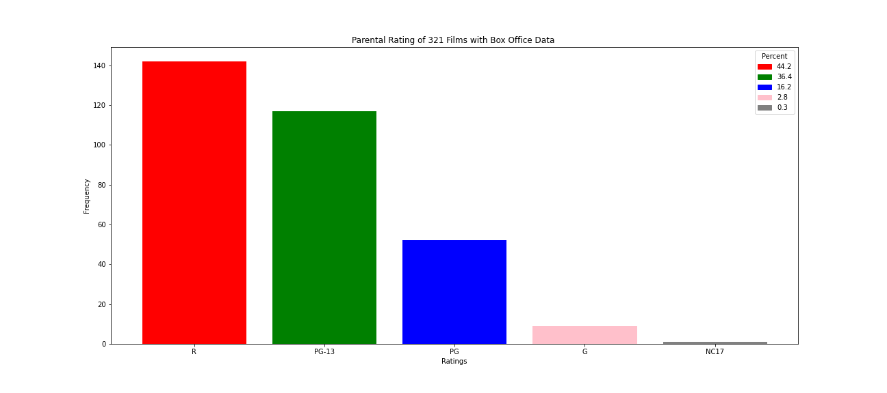
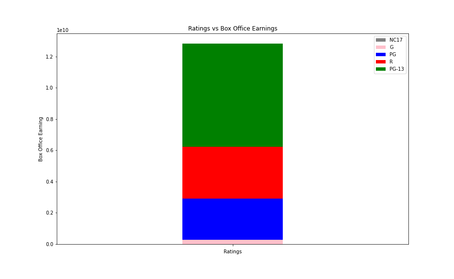
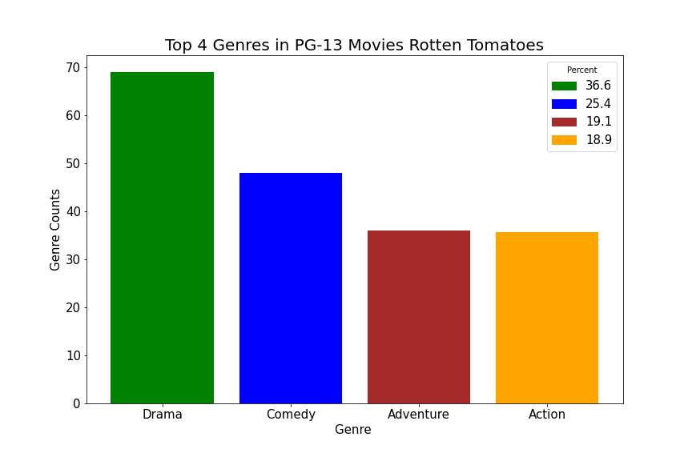
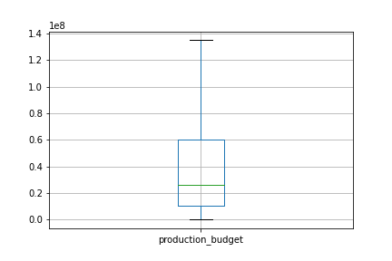
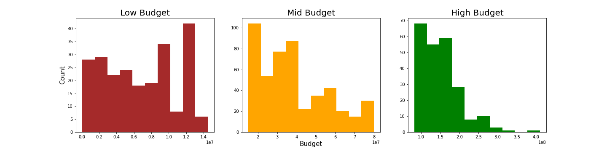
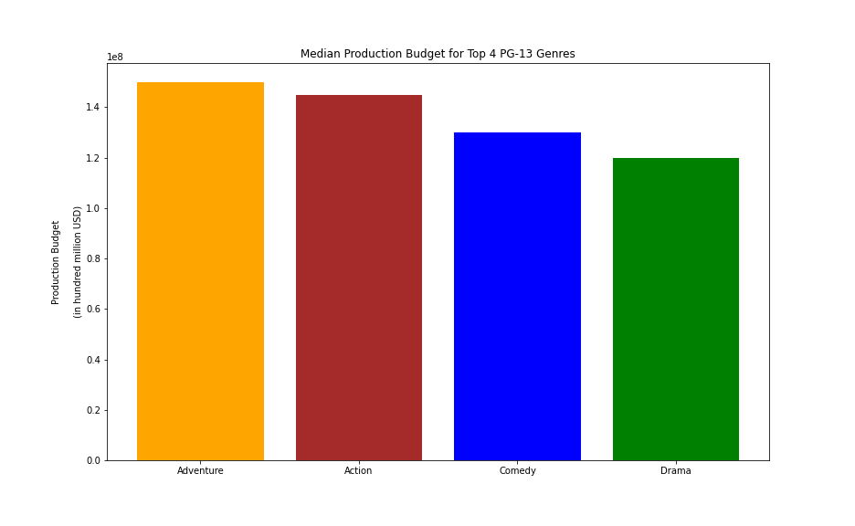

# Movie Analysis
 

## Overview
This project will analyze what types of films are currently doing the best at the box office to help Microsoft decide what type of films to create.  

## Business Problem
### What is the best type of movie to make for maximum profit?
We each looked at what aspects of a movie will make maximum profit.
* Parental Ratings that give best return 
* Popular Genres
* Production Budget

## How to choose which movie to create  

### Rating
We selected all the movie ratings from the data table and counted each ratings. We, then, dropped all the null data and sorted the movies by box office. 
 
Let's see how the distribution of box office earnings are for each rating.
 
Even though the R rating is more popular in our data set, PG-13 dominates in overall earnings.  

Higher earning movies were rated PG-13. This is why our first bar graph shows more R-rated movies, but our second stacked-bar graph shows more earnings for PG-13.  
From the data we were given, our recommendation is to make a movie with a PG-13 rating. 

### Genre
Now, our next question would be which genres are popular in PG-13 movies?  
With the data we used to find which movie rating showed highest earnings, we will select all the genres that have PG-13 ratings. 
 
After counting the number of each genres, we created a bar graph to show the top 4 genres that are popular in PG-13 movies
  
As you can see, Drama, Comedy, Adventure, and Action genres are the top 4 genres that are popular in PG-13 movies.  

### Production Budget
Now, with our top 4 popular genres, we want to see how much Microsoft should spend on each genre to return the best profit.  
We see that most of our data falls in the range of about 20 million to 80 million. 
  
We divided our dataframe using the genres' budgets' Inter-Quartile Range (IQR): below the 25th percentile, between the 25th-75th percentile, and above the 75th percentile. 
   
Let's see the correlation table for each range (in ascending order).
  
We see that the high-budget dataframe has the best correlation from budget to profit/profit margin.  
Because the dataframe has a skew, we will look at the median budget values for each genre. 
We'll analyze the best budgets to use for the respective genres in this dataframe.
  
The above graph shows the median range of 120 million to 150 million for the top-4 genres' production budgets.  
## Conclusion
After analyzing our data, we recommend:
* Rating: PG-13
* Genres for PG-13 Movies: Drama, Comedy, Adventure, Action
* Budget: $120,000,000 - $150,000,000
 
There is still data to be analyzed, but this would be a good starting point for Micrsoft's film studio.