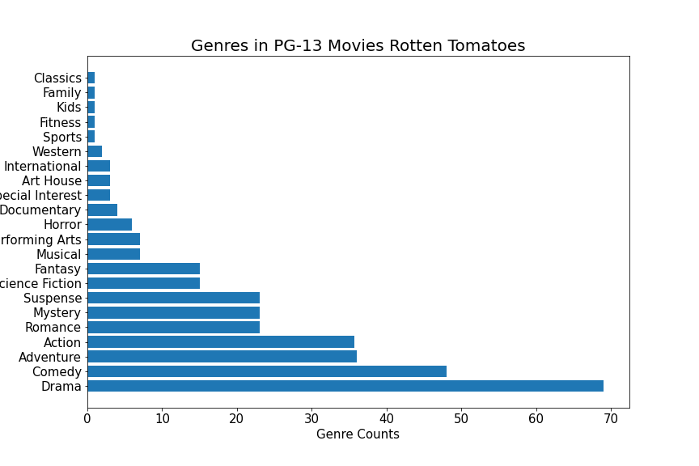
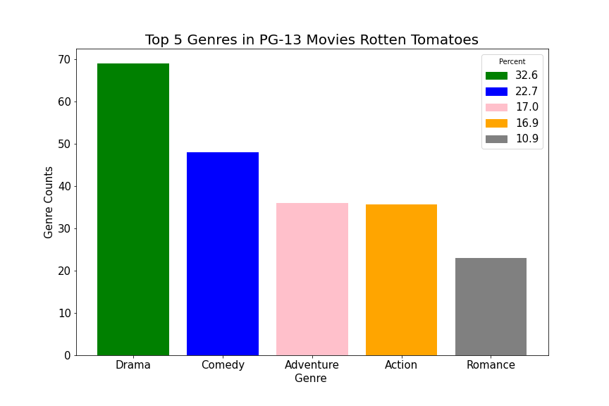

# Movie Analysis
 

## Overview
This project will analyze what types of films are currently doing the best at the box office to help Microsoft decide what type of films to create.  

## Business Problem
### What is the best type of movie to make for maximum profit?
We each looked at what aspects of a movie will make maximum profit.
* Parental Ratings that give best return 
* Popular Genres
* Correlation of budget and profit margin

## How to choose which movie to create  

### Rating
We selected all the movie ratings from the data table and counted each ratings. We, then, dropped all the null data and sorted the movies by box office. 
 
Let's see how the distribution of box office earnings are for each rating.
 
Even though the R rating is more popular in our data set, PG-13 dominates in overall earnings.  

From the graphs above, lower the earnings are, the most rating of the movie was R-rated. Higher earning movies was PG-13. This shows why our first bar graph showed more R-rated movies but our second stacked-bar graph showed more earnings for PG-13.  
From the data we were given, our recommendation is to make a movie with the PG-13 rating 

### Genre
Now, our next question would be which genres are popular in PG-13 movies?  
With the data we used to find which movie rating showed highest earnings, we will select all the genres that have PG-13 ratings. 
 
After counting the number of each genres, we created a bar graph to show the top 4 genres that are popular in PG-13 movies
  
As you can see, Drama, Comedy, Adventure, and Action genres are the top 4 genres that are popular in PG-13 movies.  

### Budget vs. Profit Margin

## Conclusion
After analyzing our data, to make maximum profit movie, we recommend:
* Rating: PG-13
* Genres for PG-13 Movies: Drama, Comedy, Adventure, Action
* Budget: $115,000,000