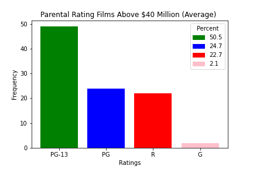
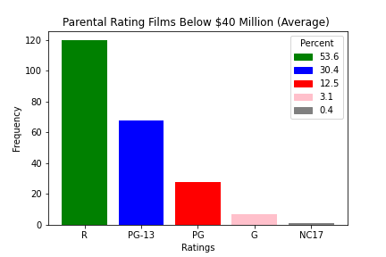

# Movie Analysis

## Overview
This project will analyze what types of films are currently doing the best at the box office to help Microsoft decide what type of films to create. 
## Business Problem
### What is the best type of movie to make for maximum profit?
We each looked at what aspects of a movie will make maximum profit.
* Correlation of budget and profit margin
* Popular Genres
* Popular Movie Ratings 
## How to choose which movie to create
### Budget vs. Profit Margin
#### If Microsoft spends x amount more, will profits increase by y?
First, we filtered out movies that was release before 2000 because money was worth different in the past than now. 
Since the range of the production budget was big, we created a box plot to see which range of budget we should use to analyze.
(bar plot)
As shown in the bar plot above, we found that most of our data stayed in the range from $5M to $150M. 
However, we also want to look at correlation for low budget movies and high budget movies.
With our filtered data, now we asked ourselves: for Microsoft to enter the film industry, what's a good production budget?
(low corr data table)
(mid corr data table)
(high corr data table)
### Genre
After sorting the movies using profit and net margin profit (over 70%), we took the genres from each movie and created bar graph to show popular genres in a movie that profited the most. 
This bar graph shows set of genres that are popular for each movie that profited the most.

You can see that Adventure, Action, Comedy, Animation, and Sci-Fi were top 5 popular genres.
Then we took the sets of genres and separated them individually to create a bar graph of each genres that are popular for each movie that profited the most.

You can see that "Action, Adventure, Sci-Fi" and "Adventure, Animation, Comedy" are the most popular set of genres for movies.
### Rating
We selected all the movie ratings from the data table and counted each ratings. 

We can see that there are some null values in the data. So, we dropped all the null data.

First, we created histograms to show the top 105 ratings in box office and bottom 105 ratings in box office.

As you can see, PG-13 movies profited the most while R-rated movies profited the least.

To check

## Conclusion